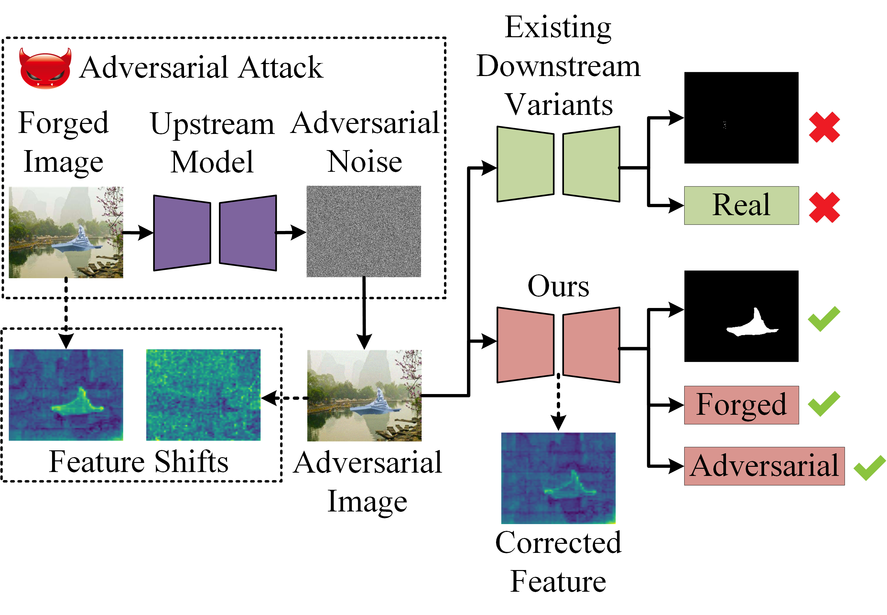
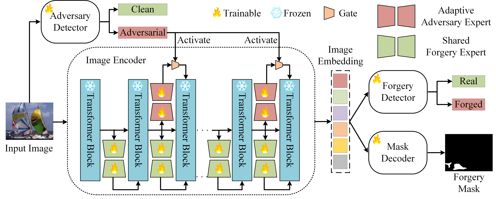
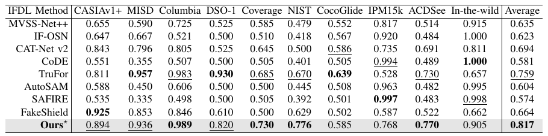
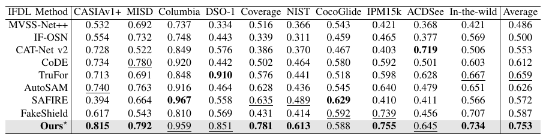
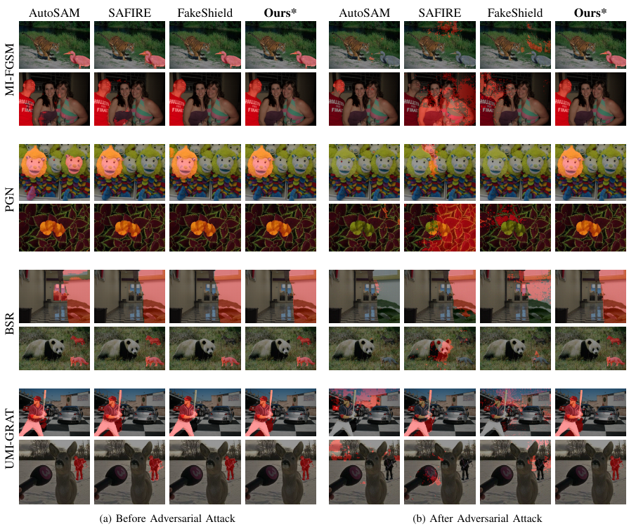

# ForensicsSAM: Toward Robust and Unified Image Forgery Detection and Localization Resisting to Adversarial Attack
<!--%[](link-to-your-paper)!-->
[](https://arxiv.org/pdf/2508.07402)
[](LICENSE)

Official PyTorch implementation of the paper.

---

## 📌 Abstract
<p align="center">
  <br>
</p>
Parameter-efficient fine-tuning (PEFT) has emerged as a popular strategy for adapting large vision foundation models—such as the Segment Anything Model (SAM) and LLaVA—to downstream tasks like image forgery detection and localization (IFDL). However, existing PEFT-based approaches often **overlook their vulnerability to adversarial attacks**.  
We show that **highly transferable adversarial images** can be crafted solely via the upstream model—without accessing the downstream model or training data—significantly degrading IFDL performance.

To address this, we propose **ForensicsSAM**, a unified IFDL framework with built-in adversarial robustness, guided by three key ideas:

1. **Shared Forgery Experts**  
   - To compensate for the lack of forgery-relevant knowledge in the frozen image encoder, we insert forgery experts into each transformer block.  
   - These experts are **always active** and **shared** across any input images, enhancing the encoder’s ability to capture forgery artifacts.

2. **Light-weight Adversary Detector**  
   - Learns to capture **structured, task-specific artifacts** in the RGB domain.  
   - Enables reliable detection of adversarial images across various attack methods.

3. **Adaptive Adversary Experts**  
   - Injected into the **global attention layers** and **MLP modules** to progressively correct feature shifts induced by adversarial noise.  
   - **Adaptively activated** by the adversary detector, avoiding unnecessary interference with clean images.

Extensive experiments across multiple benchmarks demonstrate that **ForensicsSAM** not only achieves superior resistance to diverse adversarial attacks, but also delivers **state-of-the-art performance** in both image-level forgery detection and pixel-level forgery localization.

---

## 📂 Project Structure
```
ForensicsSAM-released/
├── adversary_detector/    # Adversary detector module
├── data/                  # Dataset text lists
├── forensics_sam/         # Core ForensicsSAM model implementation
├── mini_dataloader/       # dataloader
├── segment_anything/      # SAM backbone
├── utils/                 # Helper functions and utilities
├── weight/                # Pretrained model weights
├── inference.py           # Inference script
└── README.md              # Project description
```

---

## 📋 Method Overview
<p align="center">
  <br>
  <em>Figure 1: Overview of the proposed ForensicsSAM framework. Given an input image, ForensicsSAM outputs the image-level detection results (real or forged, clean or adversarial) as well as a pixel-level forgery mask.</em>
</p>


---

## 📊 Results
### 🔹 Forgery Detection and Localization 
<p align="center">
  <br>
  <em>Table 1: Image-level forgery detection performance (ACC). First and second ranking are highlighted in bold and underline, respectively.</em>
</p>
<p align="center">
  <br>
  <em>Table 2: Pixel-level forgery localization performance (F1). First and second ranking are highlighted in bold and underline, respectively.</em>
</p>

### 🔹 Adversarial Robustness
<p align="center">
  <br>
  <em>Figure 2: Comparison of forgery localization before and after  adversarial attack. Red denotes the predicted forged regions.</em>
</p>


More results and ablation studies are available in the paper.

---

## ⚙️ Installation
```bash
git clone https://github.com/siriusPRX/ForensicsSAM.git
cd your-repo/ForensicsSAM
conda create -n ForensicsSAM python=3.9
conda activate ForensicsSAM
pip install -r requirements.txt
```

---

## 📌 Dataset and Weight Preparation
1. Download the datasets listed below:

| Dataset           | Real  | Forged  | SP | CM | INP |
|-------------------|-------|---------|----|----|-----|
| **Train**         |       |         |    |    |     |
| CASIAv2           | 7491  | 5098    | ✓  | ✓  |     |
| IMD20             | 414   | 2000    | ✓  | ✓  |     |
| FantasticReality  | 16592 | 19423   | ✓  |    |    |
| TamperedCR        | 24462 | 23981   | ✓  | ✓  |    |
| **Test**          |       |         |    |    |     |
| CASIAv1+          | 800   | 920     | ✓  | ✓  |     |
| MISD              | 620   | 296     | ✓  |   |     |
| Columbia          | 183   | 180     | ✓  |   |     |
| DSO-1             | 100   | 100     | ✓  |   |     |
| Coverage          | 100   | 100     |   | ✓  |    |
| NIST              | 875   | 564     | ✓  | ✓  | ✓    |
| CocoGlide         | 512   | 512     |   |    | ✓   |
| IPM15k            | -     | 15000   | ✓  | ✓  |    |
| ACDSee            | 364   | 337     | ✓  | ✓  | ✓  |
| In-the-wild       | -     | 201     | ✓  |    |    |

2. Organize the folders as:
```
data/
  ├── acdsee.txt
  ├── acdsee_au.txt
  ├── casia1.txt
  ├── casia1_au.txt
  ├── CocoGlide.txt
  ├── cocoglide_au.txt
  ├── columbia.txt
  ├── columbia_au.txt
  ├── coverage.txt
  ├── coverage_au.txt
  ├── dso.txt
  ├── dso_au.txt
  ├── ipm15k.txt
  ├── misd.txt
  ├── misd_au.txt
  ├── nist16.txt
  ├── nist16_au.txt
  ├── wild.txt
```

```
weight/
  ├── adversary_detector.pth
  ├── adversary_experts.pth
  ├── forgery_experts.pth
  ├── sam_vit_h_4b8939.pth
```

3. you can download the pre-trained weight from [google drive](https://drive.google.com/file/d/1stLg8bJ1W2E7dVAHC8TYj917REO4sttt/view)
---

## 💻 Inference
```bash
python inference.py
```

---

## 🙏 Acknowledgement
- This work is built upon the [SAM](https://github.com/facebookresearch/segment-anything).

---

## 🌟 Citation
If you find our work useful, please cite:
```bibtex
@article{peng2025forensicssam,
  title={ForensicsSAM: Toward Robust and Unified Image Forgery Detection and Localization Resisting to Adversarial Attack},
  author={Peng, Rongxuan and Tan, Shunquan and Kong, Chenqi and Luo, Anwei and Kot, Alex C and Huang, Jiwu},
  journal={arXiv preprint arXiv:2508.07402},
  year={2025}
}
```
